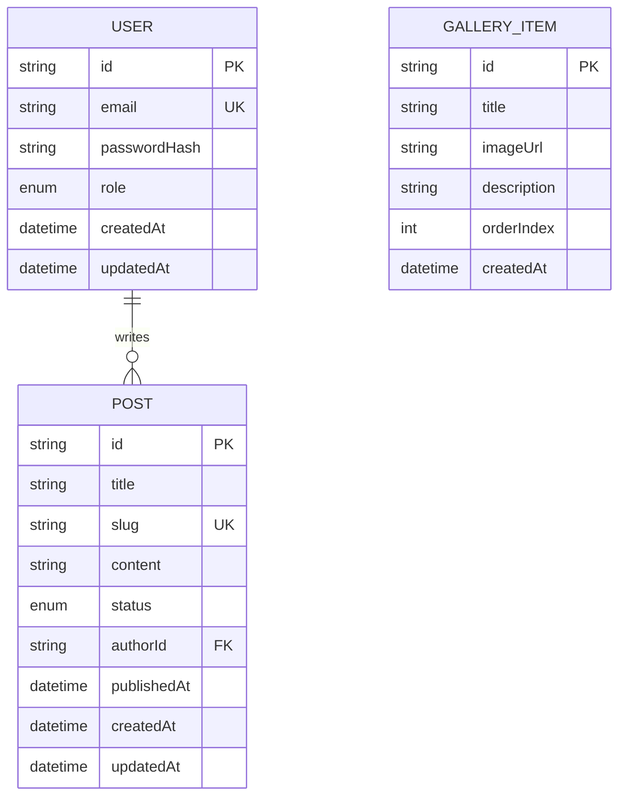

# Database Entity Relationship Diagram (ERD)

> File này là **Single Source of Truth** cho cấu trúc Database. Cập nhật bất cứ khi nào `schema.prisma` thay đổi.

---

## 📊 ERD Diagram (Mermaid)

> ⚠️ **Lưu ý**: Đây là ERD dự kiến ban đầu, chưa được khởi tạo. Cập nhật khi schema thực tế hình thành.

---

## 📋 Mô tả từng Entity

### USER
| Field | Type | Ghi chú |
|---|---|---|
| id | String (cuid) | PK, tự sinh |
| email | String | Unique, dùng để đăng nhập |
| passwordHash | String | Bcrypt hash, không bao giờ trả về client |
| role | Enum | `ADMIN` \| `VIEWER` |
| createdAt | DateTime | Auto |
| updatedAt | DateTime | Auto |

### POST
| Field | Type | Ghi chú |
|---|---|---|
| id | String (cuid) | PK |
| title | String | Tiêu đề bài viết |
| slug | String | Unique, dùng cho URL |
| content | String | Nội dung (Markdown) |
| status | Enum | `DRAFT` \| `PUBLISHED` \| `ARCHIVED` |
| authorId | String | FK → USER.id |
| publishedAt | DateTime? | Null nếu chưa publish |

### GALLERY_ITEM
| Field | Type | Ghi chú |
|---|---|---|
| id | String (cuid) | PK |
| title | String | Tên ảnh/tác phẩm |
| imageUrl | String | URL trên AWS S3 |
| description | String? | Mô tả |
| orderIndex | Int | Thứ tự hiển thị |

---

## 🔗 Relationships

| From | To | Type | Ghi chú |
|---|---|---|---|
| USER | POST | 1:N | Một admin có thể viết nhiều bài |

---

## 📎 References

- Schema file: `project/packages/database/prisma/schema.prisma`
- Naming convention: `docs/database/naming-convention.md`
- Index strategy: `docs/database/index-strategy.md`
